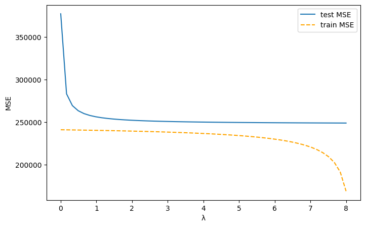
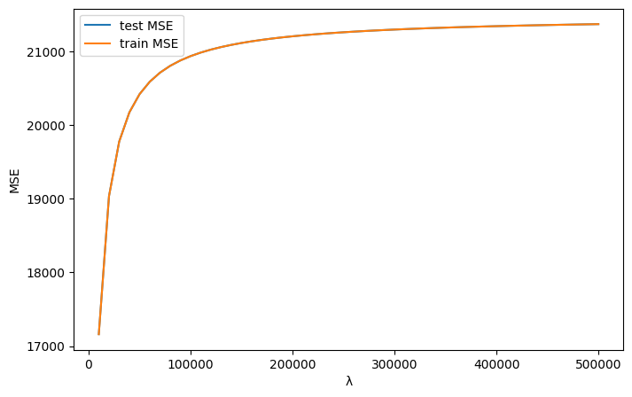
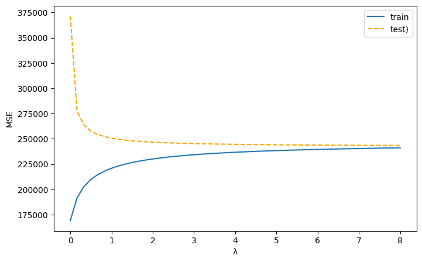

## Question 2: Gradient Descent

Apply gradient descent to Himmelblau’s function, which is often used to study the behavior of optimization algorithms in non-convex settings.

The function is given by

$$
f(u, v) = (u^2 + v - 11)^2 + (u + v^2 - 7)^2
$$

where $u, v \in \mathbb{R}$.

We use the gradient descent algorithm to find minima of $f$. Specifically, we investigate how different step-size strategies and the initialization affect convergence.

You are asked to:

- Implement a function that takes a point $(u, v)$ and returns the gradient $\nabla f(u, v)$ at that point.
- Implement a function

  ```python
  def gradient_descent(f, grad_f, eta, u0, v0, max_iter=100) -> tuple[list, list]:
      ...
  ```

  that performs the update rule

  $$
  x_{t+1} \leftarrow x_t - \eta(t)\,\nabla f(x_t),
  $$

  where $x_t = (u_t, v_t)$ and `eta(t)` is a Python method that returns the step size at iteration $t$. It is useful to make it return both the path and the function values at each step.
- Using this setup, run 100 steps of gradient descent starting at $(u_0, v_0) = (4, -5)$ and evaluate different step-size strategies.
- Evaluate different starting points.

For each of the following strategies, report:

- The final function value $f(u_{100}, v_{100})$.
- The best (lowest) value reached during training $\min_{1 \le t \le 100} f(u_t, v_t)$.

### 2a — Constant Step Size

Implement a constant step-size strategy $\eta = c$:

```python
def eta_const(c=1e-3) -> float:
    ...
```

Report:

- $f(u_{100}, v_{100}) =$
- $\min_{1 \le t \le 100} f(u_t, v_t) =$

- $f(u_{100}, v_{100}) = 0.0289$
- $\min_{1 \le t \le 100} f(u_t, v_t) = 0.0289$

### 2b — Decreasing Step Size (Inverse Square Root)

Implement a decreasing step size

$$
\eta(t) = \frac{c}{\sqrt{t + 1}}.
$$

```python
def eta_sqrt(t, c=1e-3) -> float:
    ...
```

Report:

- $f(u_{100}, v_{100}) =$
- $\min_{1 \le t \le 100} f(u_t, v_t) =$

- $f(u_{100}, v_{100}) = 12.8683$
- $\min_{1 \le t \le 100} f(u_t, v_t) = 12.8683$

### 2c — Multi-Step Schedule

Implement a piecewise-decaying step size that drops by a factor $c$ at predefined milestones. For example:

$$
\eta_{\text{multistep}}(t; [20, 50], c=0.1, \eta_{\text{init}}=1)
=
\begin{cases}
1 & t < 20 \\
0.1 & 20 \le t < 50 \\
0.01 & 50 \le t
\end{cases}
$$

Implemented with the following interface (notice the parameter settings):

```python
def eta_multistep(t, milestones=[30, 80, 100], c=1e-3, eta_init=1e-3) -> float:
    ...
```

Report:

- $f(u_{100}, v_{100}) =$
- $\min_{1 \le t \le 100} f(u_t, v_t) =$

- $f(u_{100}, v_{100}) = 3.6838$
- $\min_{1 \le t \le 100} f(u_t, v_t) = 3.6838$

### 2d — Initialization

Repeat the above experiments using a constant step size with different starting points $(u_0, v_0)$:

- $p_1 = (-4, 0)$
- $p_2 = (0, 0)$
- $p_3 = (4, 0)$
- $p_4 = (0, 4)$
- $p_5 = (5, 5)$

Report the final point $(u_{100}, v_{100})$ and final function value $f_{\text{final}} = f(u_{100}, v_{100})$ for each point:

- $p_1 \rightarrow$ $u:$  $v:$  $f_{\text{final}}:$
- $p_2 \rightarrow$ $u:$  $v:$  $f_{\text{final}}:$
- $p_3 \rightarrow$ $u:$  $v:$  $f_{\text{final}}:$
- $p_4 \rightarrow$ $u:$  $v:$  $f_{\text{final}}:$
- $p_5 \rightarrow$ $u:$  $v:$  $f_{\text{final}}:$

- $p_1 \rightarrow$ $u: -3.1528$  $v:-0.7246$  $f_{\text{final}}:95.8785$
- $p_2 \rightarrow$ $u:2.9086$  $v:2.0931$  $f_{\text{final}}:0.2836$
- $p_3 \rightarrow$ $u:3.4504$  $v:-0.4817$  $f_{\text{final}}:11.1859$
- $p_4 \rightarrow$ $u:-2.3671$  $v:3.1$  $f_{\text{final}}:5.3342$
- $p_5 \rightarrow$ $u:2.9822$  $v:2.0414$  $f_{\text{final}}:0.0266$

Optional (not graded): Plot the gradient descent trajectories of the different starting points.

## Question 5: Decision Trees

We use the Titanic dataset (download it [here](https://www.kaggle.com/competitions/titanic)) to create a decision tree that predicts the survival of a passenger. The dataset includes a mix of **categorical** and **numerical** features describing personal characteristics, ticket information, and travel details. For this type of data, a decision tree is suitable because it can deal with mixed feature types and the splits preserve interpretability of the features.

Features to use in this exercise:

- Sex: the gender of the passenger (male, female) (there are, of course, in principle more than these two genders, but apparently there were no nonbinary people on the Titanic)
- Pclass: ticket class (1: highest, 2: middle, 3: lowest)
- Fare: the ticket price, correlated with Pclass but has more fine-grained information. Some cabins within one class were more expensive than others.
- Age: age of the passenger
- Embarked: port where the passenger boarded the ship (C: Cherbourg, Q: Queenstown, S: Southampton). The port had an effect on the cabins that passengers got.

As target, we use the column `Survived`, indicating a one if the passenger survived and a zero otherwise.

### 5

Compute the information gain $IG$ of all root splits for each feature. Use the Gini impurity as impurity measure. Choose the possible split points as discussed in the lecture (the unique values for discrete features and midpoints between consecutive values for continuous features).

The dataset has some missing values. Compute the information gain for a feature only on the values that are observed for that feature.

Denote below **the best root split for each feature** and their corresponding information gains:

- The root split on Sex has $IG =$.
- The best root split on Pclass is `Pclass =` ___ and has $IG =$.
- The best root split on Fare is `Fare ≥` ___ and has $IG =$.
- The best root split on Age is `Age ≥` ___ and has $IG =$.
- The best root split on Embarked is `Embarked =` ___ and has $IG =$.

- The root split on Sex has $IG =0.1396$.
- The best root split on Pclass is `Pclass =` 3 and has $IG =0.0491$.
- The best root split on Fare is `Fare ≥` 10.4812 and has $IG =0.0426$.
- The best root split on Age is `Age ≥` 6.5 and has $IG =0.0123$.
- The best root split on Embarked is `Embarked =` C and has $IG =0.0136$.

## Question 6: Lasso vs Ridge Regression

In this exercise, we try to find out if and how we can predict the cancer survival time based on gene expressions, using Lasso and Ridge regression. We use here the `METABRIC_RNA_Mutation` dataset, which is available on Canvas. You can gain additional information about this dataset [here](http://www.kaggle.com/datasets/raghadalharbi/breast-cancer-gene-expression-profiles-metabric).

Run the following code to load the data and to obtain your regression dataset and target vector:

```python
import pandas as pd

df = pd.read_csv("./METABRIC_RNA_Mutation.csv")  # adapt the path

df_D = pd.concat([df["age_at_diagnosis"], df.iloc[:, 31:520]], axis=1)
D = df_D.to_numpy()
y = df["overall_survival_months"].to_numpy()
```

We use the feature `overall_survival_months` as the regression target variable. For the observations, concatenate the feature `age_at_diagnosis` with the gene expressions. We compute the regression models using a design matrix $X$ for affine basis functions.

We compare the solutions to the following regression objectives ($n$ is the number of observations in $X$):

$$
\min_{\beta} \frac{1}{2n} \lVert y - X\beta \rVert^2 + \lambda\lVert \beta_{\neq \text{bias}} \rVert_2^2 \qquad \text{(Ridge Regression)}
$$

$$
\min_{\beta} \frac{1}{2n} \lVert y - X\beta \rVert^2 + \lambda\lVert \beta_{\neq \text{bias}} \rVert_1 \qquad \text{(Lasso)}
$$

The parameter vector $\beta_{\neq \text{bias}}$ contains all the coefficients for basis functions that do not reflect the bias term (such that we don't penalize the bias term, as discussed in the lecture).

To this end:

- Implement a function that fits a ridge regression model to a given training dataset (you have to adapt the formula for $\beta$ stated in the lecture to accommodate the elimination of the bias term and the constants of the objective function).
- Implement a function that returns the predictions of your ridge regression model for a training or test dataset.
- Use for fitting (training) and testing of the Lasso model the implementation provided by sklearn. For a range of $\lambda \in [10^{-10}, 8]$ plot the 5-fold cross-validated MSE of the training- and test-data and the average number of selected features (we say a feature is selected if the weight $|\beta_s| > 10^{-16}$) against the weight $\lambda$. You can use sklearn for the cross-validation.

### 6a

Plot the train and test MSE for Ridge Regression and Lasso against the penalization weight (varying the penalization weight on the horizontal axis) and upload your plots in the box below.

Analyze your plots with regard to the bias-variance tradeoff. For which $\lambda$ do we observe a high bias, which indicates a high variance and where is the sweet spot? What can you say about the target noise $\sigma$? Describe how we recognize the high bias/variance areas in your plot.

Compare your plots to the typical illustrations of the bias and variance (as indicated below). In what sense are your cross-validation plots reflecting what we expect in theory from the bias and variance plot, and in what sense do they differ?


### 6b

Plot the sparsity of the regression vector for Ridge Regression and Lasso against the penalization weight. Upload the plots in the textbox below and discuss the effect of the penalization weight on the sparsity.

What do you observe? Are the plots aligned with the properties of Ridge Regression and Lasso that we discussed in the lecture? What can we infer from the sparsity of the regression vector with regard to the fit of the model, as indicated in the question above?

### 6c

Discuss each of the following test- and train-MSE plots. In what scenarios can these plots be possible, or if not possible at all, then give a reason. Discuss what the possible plots indicate in terms of the bias, the variance, and the irreducible noise of the target.

The test-MSE is in blue, and the train-MSE is in orange.

#### (a)



#### (b)



#### (c)




## Question 4: Naive Bayes

Apply the Naive Bayes algorithm for text document classification. We use a subset of the 20 Newsgroups dataset containing documents from the following four newsgroup categories:

| Class label | Class name |
| --- | --- |
| **0** | **sci.space** |
| **1** | **misc.forsale** |
| **2** | **comp.graphics** |
| **3** | **rec.sport.hockey** |

Use Naive Bayes to classify text documents into one of the four categories above, based on the presence or absence of specific words.

Each document is represented as a binary (indicator) bag-of-words matrix:

$$
D \in \{0, 1\}^{n \times d}
$$

- Each row corresponds to a document.
- Each column corresponds to a specific word in the vocabulary.
- Entries indicate the presence (1) or absence (0) of each word.

### 4a — Compute log-conditional probabilities (Laplace smoothing)

Use Laplace smoothing (with smoothing parameter $\alpha = 1 \times 10^{-5}$) to compute the conditional probability of observing the word **chip** given each class. Report your answers as natural logarithms.

- $\ln p\bigl(x_{\text{chip}} = 1 \mid y = 0\bigr) =$ 
- $\ln p\bigl(x_{\text{chip}} = 1 \mid y = 1\bigr) =$ 
- $\ln p\bigl(x_{\text{chip}} = 1 \mid y = 2\bigr) =$ 
- $\ln p\bigl(x_{\text{chip}} = 1 \mid y = 3\bigr) =$

### 4b — Posterior probabilities (Bayes’ theorem)

Calculate the posterior probabilities using Bayes’ theorem for classifying a document based on the presence of a key class-specific word:

- $p\bigl(y = 0 \mid x_{\text{electronics}} = 1\bigr) =$ 
- $p\bigl(y = 1 \mid x_{\text{sale}} = 1\bigr) =$
- $p\bigl(y = 2 \mid x_{\text{games}} = 1\bigr) =$ 
- $p\bigl(y = 3 \mid x_{\text{ball}} = 1\bigr) =$
